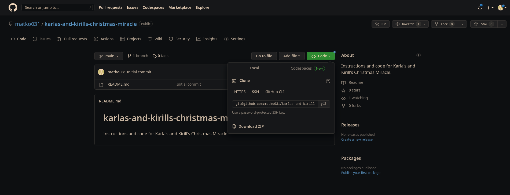

# Karla's and Kirill's Christmas Miracle
These are the instructions for constructing, and modifying, Karla's and Kirill's magical Christmas Lamp. Once assembled, the final product should look like this:

1. Download the provided code:  
2. 
	

1. Download [Arduino IDE](https://www.arduino.cc/en/software).

1. Connect the arduino to your PC using the white cable provided and follow [these steps](https://e-radionica.com/hr/blog/2018/11/07/programiranje-croduino-basic3-iz-arduino-ide/) to set it up.

1. Go to file -> open, and open the calibrate script inside the downloaded folder.  Press `upload` button in the top left corner. The `upload` button will put the code you have currently open onto the arduino board. Follow the instructions written in the file.  

	

1. Go to file-> open, and open `kk_christmas` script inside the downloaded folder. You will have to edit the script before you can run it. This main part of the script is the `loop()` function at the bottom. The code inside this function gets continuously executed while the arduino is running. The main logic of the function is to detect whenever there is a clap (that happens inside the `waitForClap()` function), and then toggle the state of the relay (that happens in the loop function with command `digitalWrite(relayPin, !digitalRead(relayPin));`).   

	Inside the `waitForClap()` function, there is a for loop. This loop takes 80 iterations to run, which corresponds to about 80ms. When processing audio in real-time, you always have to split the incoming sound signal into blocks. In this case, block size is 80 seconds. In each iteration of the loop, a new sound measurement is taken. Physically, sound is a pressure wave travelling through the air. Each sound makes air particles vibrate. Each sound measurement returns the air pressure at the microphone at that moment. This pressure can be positive or negative. This value is evaluated by command `amplitude = analogRead(0) - 512 + offset;` inside the code. Loud sounds have high amplitude and quite sounds low amplitude. Whenever there is high-frequency sound, the air will vibrate  fast, and for low frequency sounds it will be slow.  
	
	Due to the reasons outside of the scope of this document, a hand clap generates high-frequency sound which is not encountered in usual speech.  The way how the clap detection works is that for each incoming sound above certain amplitude threshold (we don't want random quite noises to turn the lamp on/off), it is checked whether a zero crossing happened since the last measurement. At the end of each analysed block (approximately every 10ms), it is checked how many zero crossings happened. In case this number is above certain threshold, a clap is detected and the lamp state is toggled.  
	
	On several places inside the code, you will encounter `<insert variable here>`. Your job is to figure out which variable needs to be put there in order to make the code work properly.  Once you are done, press `upload` button to put the code on the arduino board.

1. Connect the Microphone to the Arduino    

	

    | Mic pin  | Arduino pin |
    | :-----------: | :-----------: |
    | G  | gnd  |
    | + | +5V  |
    | AO | A0  |

1. Connect the Relay to the Arduino. A relay is a simple device which allows you to control high voltages (i.e., the power chord powering the lamp) with low voltages (i.e., the control signal from Arduino).   

	

    | Relay pin  | Arduino pin |
    | :-----------: | :-----------: |
    | GND  | gnd  |
    | VCC | +5V  |
    | IN | 10  |

1. Connect the power to Arduino.   

   
   
1. The final packaging should look like this:  

   
   
1. Run the setup and test it out! Feel free to adjust the amplitude and zero crossings thresholds to achieve the optimal solution for your setup. If you are feeling adventerous, you can also try to make it so, that only two claps in succession trigger the switch, so you have even less false positives.   

# Have fun and Merry Cristmas!  

